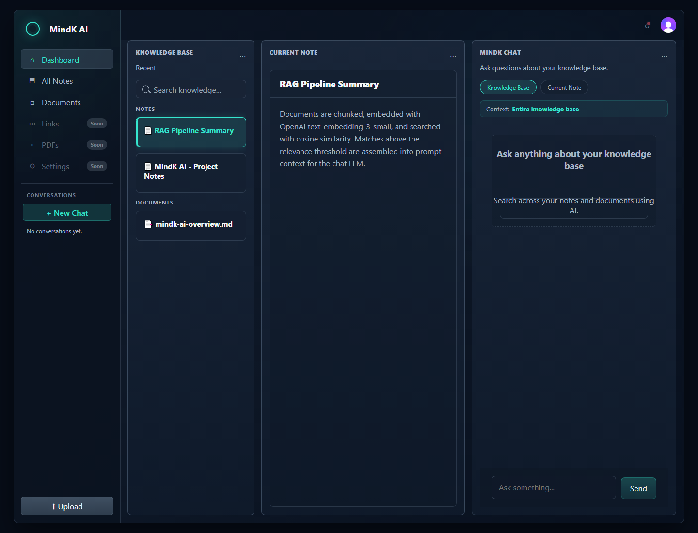
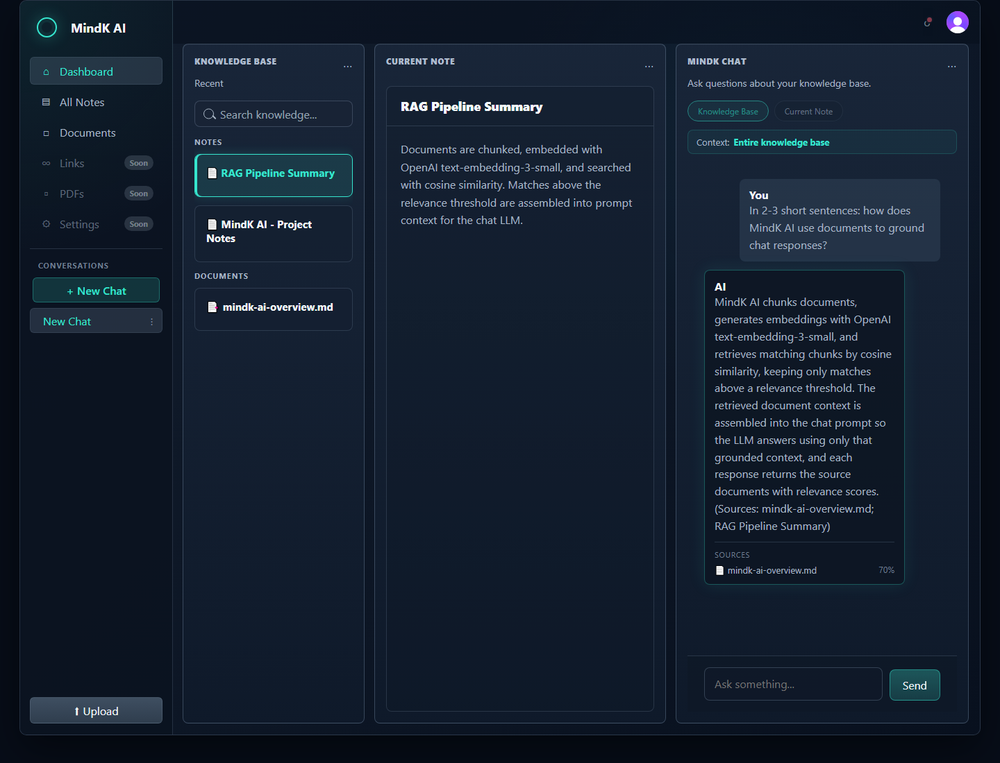
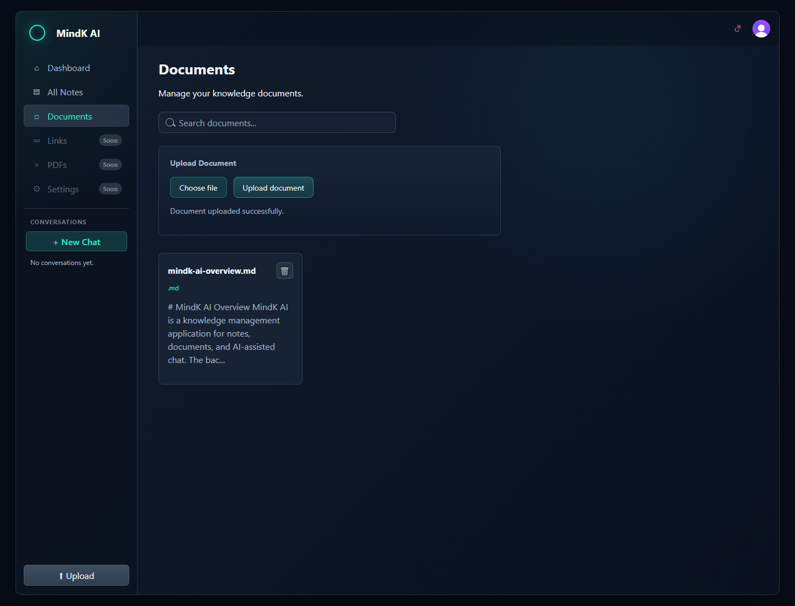
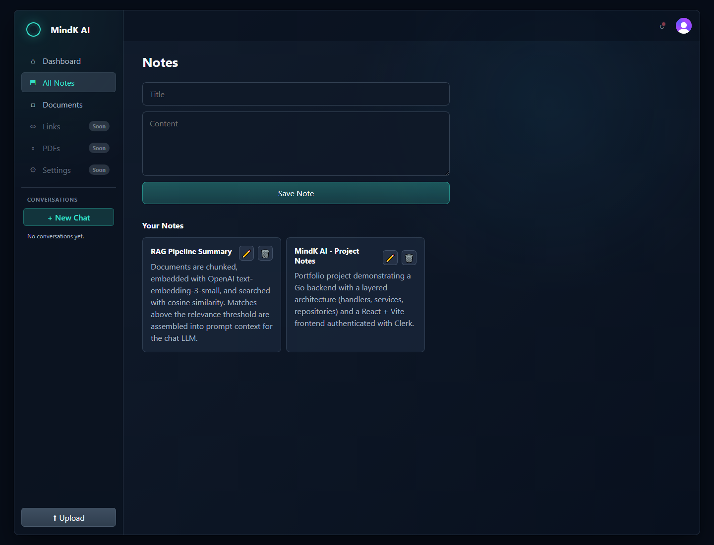
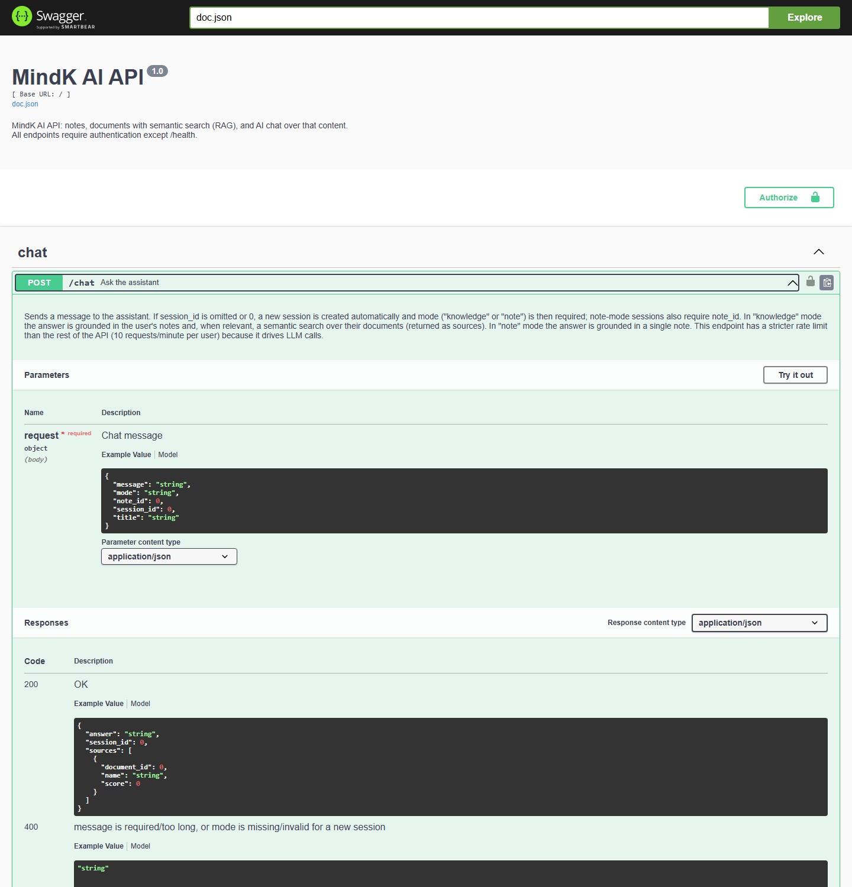

# MindK AI

MindK AI is a knowledge-management app that lets you write notes, upload documents, and chat with an AI assistant that answers questions grounded in that content — instead of relying only on the model's general knowledge.



## Project Motivation

Most personal AI chat tools have no memory of what you actually know — they answer from general training data, not from your own notes and documents. MindK AI was built to close that gap: a place to keep notes and documents, and a chat assistant that can actually search that knowledge base and answer using it, citing which sources it drew from.

That's what motivated building a real retrieval-augmented generation (RAG) pipeline rather than a thin wrapper around a chat API — documents are chunked, embedded, and semantically searched so the assistant's answers can be traced back to something the user actually wrote or uploaded.

## What MindK AI Does

- Create, edit, and organize personal **notes**
- Upload **documents** (PDF, Markdown, plain text) to a personal knowledge base
- Automatic **chunking and embedding** of uploaded documents
- **Semantic search** over stored document chunks (cosine similarity)
- **Chat with an AI assistant**, either grounded in a single note or in the entire document knowledge base
- Chat responses include **cited sources** with relevance scores
- **Authentication** and per-user data isolation — every user only ever sees their own notes, documents, and conversations

## RAG in Action

When a chat is in "knowledge base" mode, MindK AI embeds the question, searches the user's stored document chunks by cosine similarity, and feeds the best-matching passages into the prompt as context — so the assistant answers from the user's own documents rather than guessing.



In the screenshot above, the assistant answers a question about the RAG pipeline itself, grounded in an uploaded `mindk-ai-overview.md` document, and shows the source document with its relevance score beneath the answer.

For the complete technical flow (chunking, embeddings, prompt assembly), see [Architecture](docs/ARCHITECTURE.md).

## Key Features

### Knowledge Management

- Notes (create, edit, browse)
- Document upload (PDF / Markdown / text)
- Automatic document chunking and embedding on upload

### AI

- AI chat assistant
- RAG-based contextual answers over the document knowledge base
- Per-response source references with relevance scores

### Security

- Authentication via Clerk
- Per-user data isolation enforced at the database layer (cross-user access returns 404, verified by integration tests)
- Rate limiting, security headers, and request size limits on the API

### Developer Experience

- REST API with Swagger/OpenAPI documentation (development environment)
- Automated backend unit and integration tests
- Docker support for the backend + PostgreSQL

## Technologies

### Frontend

- React 19 + TypeScript
- Vite
- React Router v7

### Backend

- Go (`net/http`, standard library `http.ServeMux` — no external web framework)

### Data

- SQLite (development)
- PostgreSQL (production)

### AI Stack

- OpenAI (chat completions + embeddings)
- Custom RAG pipeline (chunking, embeddings, cosine-similarity search)

### Infrastructure

- Docker / Docker Compose

### Authentication

- Clerk

## Screenshots

### Dashboard

Notes, documents, and chat side by side.


### Documents



### Notes



### API (Swagger)



## Project Structure

```text
mindk-ai/
├── backend/
│   ├── cmd/api/            # main.go — entry point
│   ├── internal/
│   │   ├── handlers/       # HTTP handlers (one per resource)
│   │   ├── services/       # business logic (notes, chat, documents, RAG)
│   │   ├── repository/     # SQL data access, user-scoped queries
│   │   ├── llm/            # OpenAI client (chat + embeddings)
│   │   ├── middleware/     # auth, rate limiting, security headers, logging
│   │   ├── migrations/     # SQLite + PostgreSQL migrations
│   │   └── ...
│   ├── docs/               # generated Swagger/OpenAPI files
│   └── Dockerfile
├── frontend/
│   ├── src/
│   │   ├── pages/          # Dashboard, Notes, Documents, Auth
│   │   ├── components/     # UI grouped by domain (chat, notes, documents, ...)
│   │   ├── services/       # API client wrappers
│   │   └── context/        # chat session / selected knowledge state
│   └── package.json
├── docs/
│   ├── ARCHITECTURE.md
│   └── screenshots/
├── docker-compose.yml
└── README.md
```

`backend/` is a Go REST API organized in layers (handlers → services → repositories). `frontend/` is a React + Vite single-page app. `docs/` holds the full architecture write-up and the screenshots used in this README.

## Getting Started

### 1. Clone the repository

```bash
git clone https://github.com/pitercoding/mindk-ai.git
cd mindk-ai
```

### 2. Environment variables

Both apps read configuration from `.env` files, based on the committed examples:

```bash
cp backend/.env.example backend/.env
cp frontend/.env.example frontend/.env
```

Backend (`backend/.env`):

| Variable | Required | Notes |
| --- | --- | --- |
| `OPENAI_API_KEY` | yes | your own OpenAI API key |
| `CLERK_SECRET_KEY` | yes | your own Clerk secret key |
| `APP_ENV` | no | `development` (default) or `production` |
| `PORT` | no | defaults to `8080` |
| `FRONTEND_ORIGIN` | no in dev | defaults to `http://localhost:5173`; required in production |
| `DATABASE_PATH` | no | SQLite file path, dev only, defaults to `./data/mindk.db` |
| `DATABASE_URL` | yes in production | PostgreSQL connection string |

Frontend (`frontend/.env`):

| Variable | Required | Notes |
| --- | --- | --- |
| `VITE_CLERK_PUBLISHABLE_KEY` | yes | your own Clerk publishable key (safe to expose to the browser) |
| `VITE_API_URL` | no | defaults to `http://localhost:8080` |

You'll need your own OpenAI and Clerk accounts/keys — none are provided here.

### 3. Start the backend

```bash
cd backend
go run ./cmd/api
```

The API starts on `http://localhost:8080`. In development it uses a local SQLite database and applies migrations automatically on startup — no manual database setup needed.

### 4. Start the frontend

```bash
cd frontend
npm install
npm run dev
```

The app runs on `http://localhost:5173`.

### 5. Database

In development, the backend defaults to a SQLite file (`backend/data/mindk.db`) and runs pending migrations automatically at startup. No PostgreSQL setup is required unless you want to run the backend in production mode (see Docker below).

## Running with Docker

`docker-compose.yml` runs the backend against a containerized PostgreSQL instance (production mode):

```bash
OPENAI_API_KEY=your_key CLERK_SECRET_KEY=your_key docker compose up
```

This starts PostgreSQL and the backend API on `http://localhost:8080`. The frontend is not part of the compose setup and is run separately with `npm run dev` as shown above, pointed at `VITE_API_URL=http://localhost:8080`.

## API Documentation

The backend exposes a REST API. Interactive Swagger/OpenAPI documentation is served at `/swagger/` when running in the `development` environment (it is intentionally not registered in production).


## Testing

The backend has unit tests colocated with the code (handlers, services, repositories, middleware) and integration tests that exercise the full HTTP stack, including authentication and cross-user data isolation, against a real SQLite database.

```bash
cd backend
go test ./...
```

A separate PostgreSQL-specific integration suite runs when `POSTGRES_TEST_URL` is set, and is skipped otherwise.

## Architecture

MindK AI is a React frontend talking to a modular, layered Go backend (handlers → services → repositories) over a REST API, backed by SQLite in development and PostgreSQL in production, with a RAG pipeline (chunking → embeddings → semantic search → context assembly) powering document-grounded chat via OpenAI.

For a detailed explanation of the application architecture, RAG pipeline, authentication, data ownership, and security decisions, see the [Architecture documentation](docs/ARCHITECTURE.md).

## Project Status

MindK AI is a portfolio/demo project. It has automated tests and a documented architecture, but it hasn't been deployed as a public live demo.

## Next Improvements

- Frontend component tests (none currently exist)
- CI pipeline (e.g. GitHub Actions) to run backend tests automatically
- Improved presentation of semantic search results in the UI
- A vector index (e.g. pgvector) if per-user document volume grows large enough to make full-scan cosine similarity a bottleneck
- Frontend performance work (code splitting, etc.) as the app grows

## Portfolio / Engineering Highlights

- A real RAG pipeline (chunking, embeddings, semantic search, cited sources) rather than a simple LLM wrapper
- Authenticated, multi-user data isolation enforced in SQL and verified by integration tests
- Layered Go backend with dependency-injected LLM client, testable without hitting OpenAI
- Automated backend unit and integration tests
- Swagger/OpenAPI documentation generated from code
- Docker support and a dev/production database strategy (SQLite → PostgreSQL)

## License

MIT — see [LICENSE](LICENSE).
