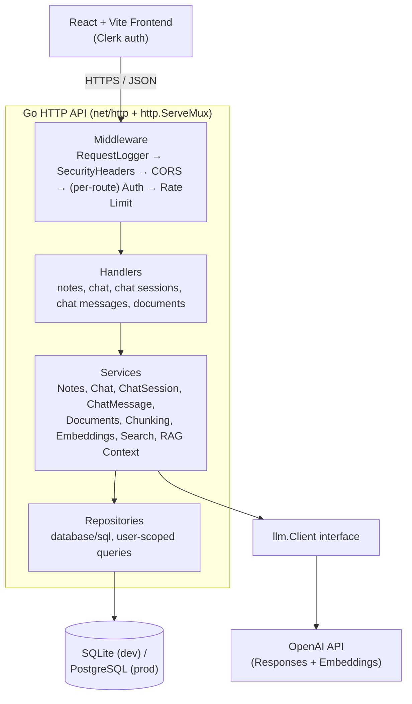

# MindK AI Architecture

This document describes the architecture of MindK AI **as it exists in the codebase today**. It is generated from a direct audit of the source (backend and frontend) and does not describe planned or aspirational features.

## Overview

MindK AI is a knowledge-management application: users write notes, upload documents, and chat with an AI assistant that answers questions grounded in that content (notes directly, documents through a retrieval-augmented generation pipeline). It ships as two applications:

- **Backend**: a Go HTTP API (`backend/`) organized as a layered monolith — handlers, services, repositories, a database layer, and an LLM integration layer.
- **Frontend**: a React + Vite single-page app (`frontend/`) that authenticates users via Clerk and talks to the backend over JSON/HTTP.

Both are deployed and run as two independent processes; there is no shared runtime, message queue, or service mesh between them.

## Architecture Diagram



The diagram reflects the real call graph confirmed in [`backend/internal/app/app.go`](../backend/internal/app/app.go), [`backend/internal/routes/routes.go`](../backend/internal/routes/routes.go), and [`backend/cmd/api/main.go`](../backend/cmd/api/main.go).

## Architectural Style

MindK AI is a **monolithic, modular Go backend** paired with a separate single-page frontend. It is not a microservices architecture, not event-driven, and does not use a distributed job queue or orchestration platform. All backend domains (notes, documents, chat, embeddings, search) run in one process, one binary, one deployable unit, communicating through in-process Go interfaces rather than network calls.

## System Components

### Frontend

- **Stack**: React 19 + Vite + TypeScript, React Router v7 (`createBrowserRouter`) for routing, `@clerk/react` for authentication ([`frontend/package.json`](../frontend/package.json)).
- **Auth**: the whole app is wrapped in `<ClerkProvider>` ([`frontend/src/main.tsx`](../frontend/src/main.tsx)). `ProtectedRoute` ([`frontend/src/components/auth/ProtectedRoute.tsx`](../frontend/src/components/auth/ProtectedRoute.tsx)) uses Clerk's `useAuth()` to redirect unauthenticated users to `/auth` and gate every route under `/`.
- **API communication**: a single `apiClient()` helper ([`frontend/src/api/client.ts`](../frontend/src/api/client.ts)) reads the Clerk session token via `getToken()` and attaches it as `Authorization: Bearer <token>` on every JSON request. The multipart upload path (`documentUploadService.ts`) does the same outside the shared helper, since it needs `FormData` instead of a JSON body.
- **Organization**: `pages/` (route-level screens: Dashboard, Notes, Documents, Auth), `components/` grouped by domain (`chat/`, `documents/`, `notes/`, `dashboard/`, `layout/`, `auth/`, `common/`), `services/` (one file per backend resource, each a thin wrapper around `apiClient`), `context/` (`ChatSessionContext`, `SelectedKnowledgeContext` — React Context + hooks, no external state library), `types/` (TypeScript mirrors of the backend JSON contracts).
- **Data flow**: pages fetch data through services on mount, hold it in local `useState`, and pass it down as props; the two contexts hold cross-page state (active chat session, currently-selected note/document) that multiple components need without prop-drilling.

### Routing

- The backend uses Go's standard-library `http.ServeMux` ([`backend/internal/routes/routes.go`](../backend/internal/routes/routes.go)) — no external HTTP framework (no Gin, Echo, Chi, etc.) is a dependency of the module ([`backend/go.mod`](../backend/go.mod)).
- Routes are registered explicitly in `RegisterRoutes(mux, app)`, called once from `main.go`. Each handler is wrapped inline with the middleware it needs: `mux.Handle("/chat", protected(chatLimit(http.HandlerFunc(app.ChatHandler.Ask))))`.
- `/health` is the only route with no middleware wrapper (public, used for uptime checks).
- `/swagger/` is registered conditionally — only when `app.Environment == config.EnvDevelopment` — so the Swagger UI does not exist as an attack surface in production.
- Sub-resource routing (e.g. `/notes/{id}`) is done by registering a prefix pattern (`/notes/`) and parsing the trailing path segment inside the handler via `httputil.GetIDFromPath` ([`backend/internal/httputil/params.go`](../backend/internal/httputil/params.go)) — `http.ServeMux` at the Go version in use does not need a router-level path-parameter feature for this project's route shapes.

### Middleware

Applied in two layers:

**Global** (wraps the whole mux, in `main.go`): `RequestLogger(SecurityHeaders(corsHandler))`, where `corsHandler` is `rs/cors` wrapping the mux itself. Every request — including `/health` — passes through logging, security headers, and CORS.

**Per-route** (in `routes.go`): `protected(rateLimiter(handler))`, so on a matched route the order is: **Clerk authentication → rate limiting → handler**. This order is load-bearing: the rate limiter keys its counters by the authenticated user ID, which only exists in the request context after the auth middleware has run ([`backend/internal/middleware/ratelimit.go`](../backend/internal/middleware/ratelimit.go)).

Full effective order for a protected route: `RequestLogger → SecurityHeaders → CORS → Clerk Auth → Rate Limit → Handler`.

| Concern | File | Behavior |
|---|---|---|
| Authentication | `middleware/clerk.go` | Verifies the Clerk session JWT from `Authorization: Bearer <token>` via the official Clerk Go SDK; on success stores the user ID in context; 401 otherwise. |
| Rate limiting | `middleware/ratelimit.go` | Fixed-window, in-memory, per authenticated user ID. General routes: 60 req/min; `/chat`: 10 req/min ([`routes.go`](../backend/internal/routes/routes.go)). Returns 429 with a `Retry-After` header. |
| Security headers | `middleware/security.go` | `X-Content-Type-Options: nosniff`, `X-Frame-Options: DENY`, `Referrer-Policy: no-referrer`, `Cache-Control: no-store`, `Strict-Transport-Security` (HSTS), and `Content-Security-Policy: default-src 'none'` (relaxed only for the dev-only `/swagger/` path). |
| CORS | `main.go` (`rs/cors`) | Single allowed origin (`FRONTEND_ORIGIN`), methods GET/POST/PUT/DELETE, headers `Content-Type`/`Authorization`. |
| Logging / correlation ID | `middleware/logging.go` | Generates a random request ID, exposes it via the `X-Request-ID` response header and request context, and logs one structured JSON line per request (method, path, status, duration, request ID, user ID when authenticated) — never request/response bodies. |

### Handlers

Located in `backend/internal/handlers/`, one file per resource (`note_handler.go`, `chat_handler.go`, `chat_session_handler.go`, `chat_message_handler.go`, `document_handler.go`, `health.go`). Their responsibility is intentionally narrow:

1. Extract the authenticated user ID from context (`auth.UserIDFromContext`).
2. Decode and validate the request (JSON body size limits via `httputil.DecodeJSON`/`httputil.MaxJSONBodyBytes`, field length limits, required-field checks, path ID parsing).
3. Call exactly one service method, passing the user ID explicitly.
4. Translate the result (or a small set of known error sentinels, e.g. `sql.ErrNoRows`, `repository.ErrChatSessionNotFound`) into an HTTP status and JSON body.

Handlers never build SQL, never call the LLM client directly, and never decide *what* the answer to a chat message is — that logic lives one layer down, in services. Every handler depends on a locally-declared narrow interface (e.g. `DocumentService` inside `document_handler.go`) rather than a concrete service type, which is what makes handler unit tests possible without a database.

### Services

Located in `backend/internal/services/`, each owns one domain and depends only on the narrow interfaces it needs (defined next to the service that consumes them, not next to the implementation):

- **NoteService** — CRUD over notes, user-scoped.
- **ChatSessionService** — CRUD over chat sessions (a session has a `mode`: `"knowledge"` or `"note"`, and optionally a `note_id`).
- **ChatMessageService** — persists and retrieves messages within a session.
- **DocumentService** — orchestrates document creation: persists the document, then triggers chunking and embedding generation, rolling back (deleting the document, which cascades) if either step fails.
- **DocumentChunkService** — thin wrapper over chunk persistence.
- **DocumentEmbeddingService** — generates an embedding per chunk and persists it.
- **DocumentSearchService** — semantic search: embeds the query, loads all of the user's stored embeddings, scores them by cosine similarity, filters below a relevance threshold, and returns the top matches.
- **DocumentContextService** — turns search results into prompt-ready text plus a deduplicated, scored list of source documents, capped at a character budget.
- **ChatService** — the orchestrator: resolves or creates a session, loads history, saves the incoming message, gathers notes and/or RAG document context depending on the session's mode, builds the final prompt, calls the LLM, and persists the assistant's reply.

This is where the RAG pipeline crosses layers: `ChatService` doesn't know how search or embeddings work — it only knows it has a `DocumentContextProvider` it can ask for context. That provider (`DocumentContextService`) doesn't know how embeddings are generated — it only knows it has a `DocumentSearcher`. This keeps each service testable in isolation with hand-written fakes (`backend/internal/services/mocks/`).

### Repositories

Located in `backend/internal/repository/`, one per table-ish concern (`note_repository.go`, `document_repository.go`, `document_chunk_repository.go`, `document_embedding_repository.go`, `chat_session_repository.go`, `chat_message_repository.go`). Responsibilities:

- Own all raw SQL (`database/sql`, no ORM). Nothing above this layer constructs a query.
- Every query that reads, updates, or deletes a specific row includes `WHERE id = $1 AND user_id = $2` (or joins back to a table that has `user_id`, for chunks/embeddings) — ownership is enforced in SQL, not just checked in application code.
- All placeholders use SQL-native positional syntax (`$1`, `$2`, ...). This is Postgres's native placeholder style, and it is also accepted directly by the `modernc.org/sqlite` driver used in development, so the same query text works unmodified against both dialects — no query-building abstraction is needed to bridge them.
- `Create` methods use `INSERT ... RETURNING id` to get the generated ID back in one round trip; both the SQLite driver and the PostgreSQL driver in use support `RETURNING`.
- A failed `UPDATE`/`DELETE` (zero rows affected) returns `sql.ErrNoRows`, which handlers translate to 404 — this is also how cross-user access attempts surface as "not found" rather than "forbidden" (see [Authentication and Data Isolation](#authentication-and-data-isolation)).

### Database

- **Development**: SQLite via `modernc.org/sqlite` (a pure-Go driver, no CGo), file path from `DATABASE_PATH` (default `./data/mindk.db`). Connection is capped at `SetMaxOpenConns(1)` and opened with `PRAGMA foreign_keys = ON`, since SQLite does not enforce foreign keys by default and this project relies on `ON DELETE CASCADE`.
- **Production**: PostgreSQL via `jackc/pgx/v5`, connection string from `DATABASE_URL`. Selected automatically when `APP_ENV=production` ([`backend/internal/database/db.go`](../backend/internal/database/db.go)); `docker-compose.yml` also runs the backend in production mode locally against a containerized Postgres.
- **Environment selection**: `config.Config.IsProduction()` drives both the database dialect and which environment variables are required vs. defaulted ([`backend/internal/config/env.go`](../backend/internal/config/env.go)). In production, `FRONTEND_ORIGIN` and `DATABASE_URL` must be set explicitly — there is no silent localhost/file fallback.
- **Migrations**: `golang-migrate/migrate` with SQL files embedded at compile time (`//go:embed`) under two parallel trees, `backend/internal/migrations/sqlite/` and `backend/internal/migrations/postgres/`, kept in sync migration-by-migration (same numbering, dialect-appropriate syntax — e.g. `INTEGER PRIMARY KEY AUTOINCREMENT` vs `SERIAL`). Migrations run automatically on every backend startup (`migrations.Run` in `main.go`), before the HTTP server starts accepting requests.
- **Cascade deletes**: `document_chunks.document_id` and `document_embeddings.chunk_id` are both declared `ON DELETE CASCADE`. Deleting a document deletes its chunks and their embeddings in one operation — this is also how `DocumentService.Create` rolls back a partially-created document if chunking or embedding generation fails.

### LLM Integration

- **`llm.Client`** ([`backend/internal/llm/client.go`](../backend/internal/llm/client.go)) is a two-method interface: `Chat(prompt string) (string, error)` and `CreateEmbedding(text string) ([]float32, error)`.
- **`OpenAIClient`** ([`backend/internal/llm/openai.go`](../backend/internal/llm/openai.go)) is the only production implementation: plain `net/http` calls to OpenAI's `/v1/responses` endpoint (model `gpt-5-mini`) for chat and `/v1/embeddings` (model `text-embedding-3-small`) for embeddings. No OpenAI SDK dependency.
- **Dependency injection**: `main.go` constructs one `OpenAIClient` and passes it into `app.New`, which threads it through to every service that needs it (`ChatService` for chat completions, `OpenAIEmbeddingGenerator` — a thin adapter — for embeddings used by `DocumentEmbeddingService` and `DocumentSearchService`). Nothing below `app.New` imports `llm.OpenAIClient` directly; everything depends on the `llm.Client` interface (or the narrower `services.EmbeddingGenerator` interface it's adapted to).
- **Testability**: `backend/internal/services/mocks/fake_llm_client.go` provides a `FakeLLMClient` used by both unit tests and the full-stack integration test harness (`testutil.NewServer`), so no test suite calls the real OpenAI API. Swapping providers (a different chat/embedding API) would mean writing one new `llm.Client` implementation — no other layer would need to change.

## RAG Pipeline

Confirmed end-to-end, source-file by source-file:

```text
Document upload (DocumentHandler.UploadDocument)
      ↓  multipart file → utils.ReadFile (by extension: .pdf / .md / .txt)
Text/PDF extraction (utils/pdf_reader.go via ledongthuc/pdf, utils/file_reader.go)
      ↓
DocumentService.Create: repo.Create (INSERT ... RETURNING id)
      ↓
Chunking — utils.SplitIntoChunks(content, 500) (word-boundary-safe, character-count based)
      ↓
DocumentChunkService.CreateMany → document_chunks table
      ↓
Embedding generation — DocumentEmbeddingService.GenerateForChunks:
  one OpenAIEmbeddingGenerator.Generate(chunk.Content) call per chunk
      ↓
Embedding persistence — vector JSON-marshaled to a string, stored in
  document_embeddings.embedding (TEXT column), linked by chunk_id
      ↓
  (On chunking or embedding failure: DocumentService rolls back by deleting
   the document; ON DELETE CASCADE removes any chunks/embeddings already written.)

--- at chat time (ChatService.Ask, mode = "knowledge") ---

Semantic search — DocumentSearchService.Search(query, limit=5, userID):
  1. embed the query (same EmbeddingGenerator)
  2. load ALL of the user's embeddings (DocumentEmbeddingRepository.GetAll,
     joining document_embeddings → document_chunks → documents)
  3. utils.CosineSimilarity(query, each stored vector) — pure in-process
     computation, no vector database or ANN index
  4. filter out scores below DefaultMinRelevanceScore (0.3)
  5. sort by score descending, take the top `limit`
      ↓
Relevant document context — DocumentContextService.BuildContext:
  assembles matched chunks into prompt text, stopping at an 8000-character
  budget (the single best-scoring chunk is always included even if it alone
  exceeds the budget); also returns a deduplicated, score-ordered list of
  source documents for citation
      ↓
Prompt construction — llm.ContextBuilder.Build:
  one flat prompt with SYSTEM INSTRUCTIONS (answer only from the context
  shown, never external knowledge), CONVERSATION HISTORY, KNOWLEDGE CONTEXT
  (notes), DOCUMENT CONTEXT (the RAG text above), and the USER QUESTION
      ↓
LLM — llmClient.Chat(prompt) → OpenAI Responses API (gpt-5-mini)
      ↓
Chat response + sources — ChatService persists the assistant message, then
  returns {answer, session_id, sources[]} to ChatHandler, which serializes
  it as the /chat response body
      ↓
Frontend — ChatSessionContext.sendMessage stores response.sources on the
  message; ChatMessage.tsx renders a "Sources" list (document name + a
  rounded relevance percentage) beneath the assistant's Markdown answer
```

Two details worth calling out explicitly because they shape how the system behaves:

- **Search scans the user's entire embedding set on every query.** There is no vector index (no pgvector, no ANN library) — `DocumentSearchService.Search` loads every embedding the user owns and scores it in a Go loop. This is simple and correct at the current scale, and is a natural place to revisit if per-user document volume grows large (see [Issues Found](#issues-found-recommendations--not-implemented) below).
- **Document context only enters the prompt in `"knowledge"` mode.** `"note"`-mode sessions are grounded exclusively in the single selected note; RAG document search is not invoked for them (`chat_service.go`, `session.Mode == "knowledge"` gate).

## Authentication and Data Isolation

```text
Frontend (Clerk React SDK, ClerkProvider)
   ↓  useAuth()/getToken()
Clerk session JWT, attached as Authorization: Bearer <token>
   ↓
Go middleware — middleware.NewClerkAuth (clerk.go):
   verifies the JWT via the Clerk Go SDK (clerkhttp.WithHeaderAuthorization),
   with a 5s clock-leeway allowance; 401 if missing/invalid
   ↓
User ID in request context — auth.WithUserID(ctx, claims.Subject)
   ↓
Handlers — auth.UserIDFromContext(r.Context()) on every protected endpoint;
   the user ID from the token is the only source of truth for ownership —
   request bodies are never trusted to supply their own user_id
   ↓
Services — every method that touches user data takes userID as an explicit
   parameter (no ambient/global "current user")
   ↓
Repositories — every id-scoped SQL query filters by WHERE ... user_id = $N
   (directly, or via a join back to a table that has user_id, for
   document_chunks/document_embeddings)
   ↓
Database — a row simply does not match the query unless it belongs to the
   requesting user
```

This is deliberately **multi-user data isolation**, not just authentication: a valid, authenticated token from user B does not let user B *see that user A's data exists*. Confirmed by integration tests (`backend/internal/integration/ownership_test.go`): user B's attempts to read, update, or delete user A's notes, documents, or chat sessions/messages all resolve to **404 Not Found**, never 403 — the same status a caller would get for a genuinely nonexistent ID, so ownership checks reveal no information about other users' data. The same tests confirm user A's data is left untouched by user B's attempts.

## Request Flow

Example: `POST /chat`, an existing session, `"knowledge"` mode.

```text
React frontend (chatService.ask)
      ↓  fetch, Authorization: Bearer <clerk-jwt>
middleware.RequestLogger        — assigns request ID, starts timer
      ↓
middleware.SecurityHeaders      — sets CSP/HSTS/X-Frame-Options/etc.
      ↓
rs/cors                         — validates Origin against FRONTEND_ORIGIN
      ↓
http.ServeMux                   — routes to "/chat"
      ↓
app.AuthMiddleware (Clerk)      — verifies JWT, sets user ID in context (401 otherwise)
      ↓
Rate limiter (10 req/min/user)  — 429 + Retry-After if exceeded
      ↓
ChatHandler.Ask                 — decodes/validates the JSON body
      ↓
ChatService.Ask
      ├─ ChatSessionService.GetByID       — resolve the existing session
      ├─ ChatMessageService.GetBySessionID — load conversation history
      ├─ ChatMessageService.Save          — persist the user's message first
      ├─ NoteService.GetAll               — knowledge-mode notes
      ├─ DocumentContextService.BuildContext
      │     └─ DocumentSearchService.Search — embeddings + cosine similarity
      ├─ llm.ContextBuilder.Build          — assemble the final prompt
      ├─ llm.Client.Chat                   — call OpenAI
      └─ ChatMessageService.Save           — persist the assistant's reply
      ↓
ChatHandler                     — writes {answer, session_id, sources} as JSON
      ↓
middleware.RequestLogger        — logs method/path/status/duration/request_id/user_id
      ↓
React frontend (ChatSessionContext) — updates message list; ChatMessage renders
                                       Markdown + source citations
```

The user's message is saved to the database **before** the OpenAI call, specifically so a failed or slow LLM request never loses what the user typed (`chat_service.go` comment: "Saved before calling the LLM so the user's input is never lost if the request to OpenAI fails afterwards").

## Key Architectural Decisions

### Native Go HTTP Router (`http.ServeMux`)

No third-party HTTP framework is a dependency. The route set is small and shaped simply enough (one static path or one static prefix per resource) that the standard library's `ServeMux`, plus a small hand-rolled path-ID parser (`httputil.GetIDFromPath`), covers it without adding a dependency whose main value — complex pattern matching, route grouping, built-in middleware chaining — isn't being exercised here.

### Layered Backend

Handlers → Services → Repositories, with each layer depending only on interfaces the layer above defines for it. Handlers know nothing about SQL; repositories know nothing about HTTP; services know nothing about either. This is what makes the RAG pipeline's cross-cutting logic (chunking, embeddings, search, context assembly, prompting) testable piece by piece.

### `llm.Client` as an Interface (Dependency Injection)

The concrete OpenAI implementation is constructed exactly once, in `main.go`, and injected downward. Every consumer — `ChatService`, `DocumentEmbeddingService` (via the `EmbeddingGenerator` adapter), `DocumentSearchService` — depends on an interface, not the OpenAI type. This buys two concrete things visible in the repo: (1) the entire test suite runs without ever calling OpenAI, via `FakeLLMClient`; (2) swapping the LLM provider is scoped to writing one new file that implements `llm.Client`.

### SQLite → PostgreSQL

Development uses an embedded, zero-setup SQLite database; production uses PostgreSQL, matched by hosting-provider expectations (a managed Postgres instance, not a mounted file). The two are kept compatible deliberately: identical placeholder syntax (`$1, $2, ...`), identical use of `RETURNING id`, and two parallel migration trees applied through the same `golang-migrate` code path. A dedicated opt-in integration test suite (`postgres_test.go`, gated by the `POSTGRES_TEST_URL` environment variable) runs the full test scenarios against a real PostgreSQL instance specifically to catch any dialect drift.

### Monolithic Modular Architecture

**MindK AI is a monolithic modular application, not a microservices architecture.** Notes, documents, chat, embeddings, and search are separated by Go package and by architectural layer (handler/service/repository) within a single backend binary — not by process, network boundary, or independent deployment. There is no service discovery, no inter-service RPC, and no message broker in this codebase.

### Security Middleware

- **Per-user rate limiting**, fixed-window, in-memory: 60 requests/minute on general endpoints, 10 requests/minute on `/chat` specifically — the tighter limit exists because chat requests drive both a semantic search and an LLM call, several orders of magnitude more expensive than a CRUD request.
- **Content-Security-Policy**: `default-src 'none'` everywhere the API serves JSON (it never renders HTML), relaxed only for the development-only `/swagger/` path.
- **HSTS**: `Strict-Transport-Security: max-age=63072000; includeSubDomains`.
- **CORS**: a single allowed origin (`FRONTEND_ORIGIN`), enforced by `rs/cors`.
- **X-Frame-Options: DENY** and **X-Content-Type-Options: nosniff**, closing off clickjacking and MIME-sniffing on any response.

## Security Architecture

Beyond the middleware table above:

- **Request/response body size limits** are enforced at the handler boundary, not just documented: JSON bodies are capped at 1 MiB by default (`httputil.MaxJSONBodyBytes`), with tighter, resource-specific caps layered on top (note title/content, chat message length); document create/upload is capped at 10 MiB, with `http.MaxBytesReader` producing a proper 413 response rather than an unbounded read.
- **No secrets in logs**: `httputil.LogError`/`LogInfo` explicitly document (and their call sites follow) that request bodies, note/document/chat content, and credentials are never passed to the logger — only metadata (sizes, status codes, IDs, durations).
- **Fail-closed configuration**: `config.FromEnv` refuses to start in production without `FRONTEND_ORIGIN` and `DATABASE_URL` explicitly set — there are no silent production fallbacks to development defaults.

## Testing Architecture

- **Unit tests** are colocated with the code they test (`*_test.go` next to the source file) across handlers, services, repositories, middleware, config, and utilities. They use `stretchr/testify` and hand-written fakes in `backend/internal/services/mocks/` — one fake per consumer-defined interface (e.g. `FakeNoteProvider`, `FakeChatSessionService`, `FakeLLMClient`) rather than a mocking framework, made possible by the layered design's narrow interfaces.
- **Integration tests** (`backend/internal/integration/`) spin up the *entire* real stack — real Clerk authentication (verified against a mock JWKS server, not bypassed), real CORS, real security headers, real per-user rate limiting, and a real, freshly migrated SQLite database — behind an `httptest.Server` (`backend/internal/testutil/server.go`). The only substitution is the LLM client, swapped for `FakeLLMClient` so no test suite run depends on or bills against the OpenAI API. Coverage includes health, notes, documents, chat, cross-user ownership isolation, and adversarial input (malformed JSON, non-numeric IDs, disallowed CORS origins, missing auth).
- **PostgreSQL-specific integration tests** (`postgres_test.go`) reuse the same harness against a real PostgreSQL instance when the `POSTGRES_TEST_URL` environment variable is set, and are skipped otherwise — an opt-in check for dialect compatibility (placeholders, `RETURNING`, migrations) that doesn't slow down or complicate the default `go test ./...` run.
- **Swagger/OpenAPI**: every handler carries `swaggo` annotations; `backend/docs/` contains the generated `docs.go`, `swagger.json`, and `swagger.yaml`. The UI is served at `/swagger/` only when `APP_ENV=development`.

## README Integration Notes

For stage 8.7 (README rewrite), reusing this audit without re-deriving it:

**Belongs in the README (short, visual, portfolio-facing):**
- The Mermaid architecture diagram from this document (it's already GitHub-renderable and compact).
- A one-paragraph version of the RAG pipeline (upload → chunk → embed → search → context → LLM → cited answer) — the full step-by-step file-by-file version belongs only in this document.
- The five-line list from "What to Highlight for Portfolio": layered Go backend, native `http.ServeMux`, dependency-injected LLM client, real RAG with semantic search, multi-user ownership isolation, SQLite/PostgreSQL environment strategy.
- A single link to `docs/ARCHITECTURE.md` for anyone who wants the full detail.

**Should stay only in `docs/ARCHITECTURE.md` (too detailed for a first-page README):**
- The full middleware ordering table and rationale.
- The complete request-flow trace for `POST /chat`.
- Repository-layer details (placeholder syntax, `RETURNING id`, cascade deletes).
- The testing architecture section (unit vs. integration vs. Postgres-opt-in).
- The "Issues Found" section below — these are recommendations, not currently-true facts, and don't belong on a page meant to describe the shipped system.

**Best diagram for the README's first page**: the Mermaid flowchart above (`FE → API → MW → H → S → R → DB`, plus `S → LLM → OAI`) — it's the smallest diagram that still shows the layering and the two external dependents (the database and OpenAI), which is what a recruiter skimming the README needs to see in one glance.

**Points that deserve visual emphasis in the README**: the RAG pipeline (it's the most technically interesting part of the project and often what distinguishes this from a CRUD-with-a-chatbot-bolted-on project) and the multi-user data isolation guarantee (it's a correctness property, not just a feature, and is proven by tests — worth stating that explicitly, e.g. "cross-user access returns 404, verified by integration tests").

## Issues Found (Recommendations — Not Implemented)

These are observations from the audit, listed for awareness only, per the task's instruction not to implement architectural changes at this stage.

```text
Issue:          Semantic search loads and scores every embedding a user owns
                on every query (no vector index / ANN structure).
File:           backend/internal/services/document_search_service.go
Impact:         Search latency grows linearly with a user's total stored
                chunk count. Fine at current/expected scale; would degrade
                for a user with a very large document library.
Recommendation: If document volume grows significantly, consider a vector
                index (e.g. pgvector in PostgreSQL) — no action taken now.
```

```text
Issue:          README.md is a single line ("# mindk-ai") with no
                architecture, setup, or usage content.
File:           README.md
Impact:         None for this stage (8.5 is documentation-only and
                explicitly defers README changes to stage 8.7).
Recommendation: Addressed in stage 8.7, using the "README Integration
                Notes" section above.
```

```text
Issue:          docker-compose.yml runs the backend with APP_ENV=production
                locally (against a containerized PostgreSQL), rather than a
                dedicated "local Postgres in dev mode" configuration.
File:           docker-compose.yml
Impact:         None functionally — production mode simply requires
                FRONTEND_ORIGIN/DATABASE_URL to be set, which the compose
                file does. Worth knowing when reasoning about "development"
                vs. "production" as used by config.Config.IsProduction():
                the compose setup exercises the production code path, not
                the SQLite path.
Recommendation: No change proposed; documented here so it isn't mistaken
                for an inconsistency when read alongside this document's
                SQLite/PostgreSQL section.
```

No other inconsistency between the architecture described in the task prompt's expected diagram and the actual code was found — the expected shape (Frontend → API → Middleware → Handlers → Services → {Repositories, LLM Client} → {Database, OpenAI}) matches the real call graph.
